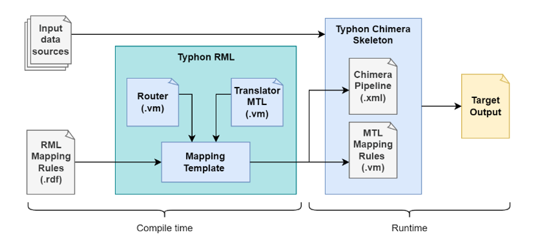

# Typhon-RML

**Typhon-RML** is a modular Java-based tool for constructing data pipelines for Knowledge Graphs (KGs) from heterogeneous data sources starting from RML mappings but with the possibility of introducing customizations. It leverages the [Chimera](https://github.com/cefriel/chimera) framework to separate concerns in the KG construction process, making it easier to customize and optimize both data access and mapping execution.

### Key Concepts

The **Typhon-RML** approach decomposes RML-based knowledge graph construction into **compile-time** and **runtime** phases.

<p align="left"></p>

At **compile-time**, the input RML mappings are transformed into:
  - A Chimera data pipeline (`route.xml`) built using Apache Camel DSL.
  - A set of template-based mapping rules (`template.vm`) defined using [MTL](https://github.com/cefriel/mapping-template).
These artifacts are modifiable before execution to support different data integration scenarios or optimizations.

At **runtime**, the generated pipeline and mappings are executed using the `typhon-chimera-skeleton` component, yielding an output equivalent to the RML's declarative intent.

How it works:

1. **Input**: Provide an RML mapping file to `typhon-rml`.
2. **Transformation**: The tool parses the RML and generates:
   - `route.xml` using `router.vm` (MTL)
   - `template.vm` using `translator.vm` (MTL)
3. **Customization (Optional)**:
   - Modify `route.xml` to use custom data sources via different Apache Camel components.
   - Adjust `template.vm` for performance tuning (e.g., optimized joins).
4. **Execution**:
   - Use `typhon-chimera-skeleton` to run the KG construction pipeline and produce the final output.

### Use Typhon-RML

```bash
java -jar target/typhon-rml.jar --rml-mapping <your-rml-file.ttl>
```

This will generate the following files:
- `route.xml`
- `template.vm`

Use the [typhon-chimera-skeleton](https://github.com/cefriel/typhon-chimera-skeleton) to execute the generated pipeline. The typhon-chimera-skeleton expects the `route.xml` and `template.vm` files to be placed in a `data` directory where the following command will be run:

```bash
java -jar target/chimera-typhon-skeleton.jar
```

Customizations can be introduced for:
- **Custom Data Access**: Modify `route.xml` to use any available [Camel component](https://camel.apache.org/components/latest/index.html) (e.g., read from a message queue instead of a file).
- **Optimized Mappings**: Edit `template.vm` to include transformations or optimizations not expressible in RML.

### Related Projects

- [Chimera](https://github.com/cefriel/chimera): Declarative data integration and transformation framework.
- [Mapping Template](https://github.com/cefriel/mapping-template): MTL-based engine for executing declarative transformation rules.
- [Apache Camel](https://camel.apache.org/): Integration framework for building routing and mediation rules.

### Publications

- Grassi M., Scrocca M., et al. (2025) _typhon-rml: Modularized Declarative Knowledge Graph Construction for Flexible Integrations and Performance Optimization_. In: 6th International Workshop on Knowledge Graph Construction co-located with the ESWC 2025. CEUR-WS. (to appear)

### Commercial Support

If you need commercial support for this repository, contact us at [chimera-dev@cefriel.com](mailto:chimera-dev@cefriel.com).

### License

_Copyright (c) 2025 Cefriel._

Licensed under the Apache License, Version 2.0 (the "License");
you may not use this file except in compliance with the License.
You may obtain a copy of the License at

    http://www.apache.org/licenses/LICENSE-2.0

Unless required by applicable law or agreed to in writing, software
distributed under the License is distributed on an "AS IS" BASIS,
WITHOUT WARRANTIES OR CONDITIONS OF ANY KIND, either express or implied.
See the License for the specific language governing permissions and
limitations under the License.
